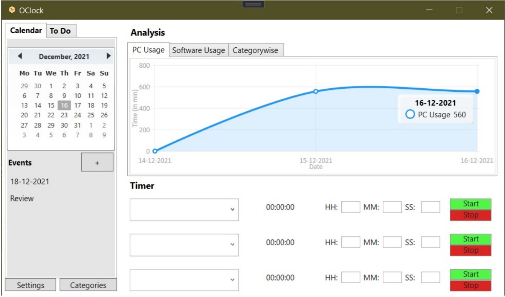
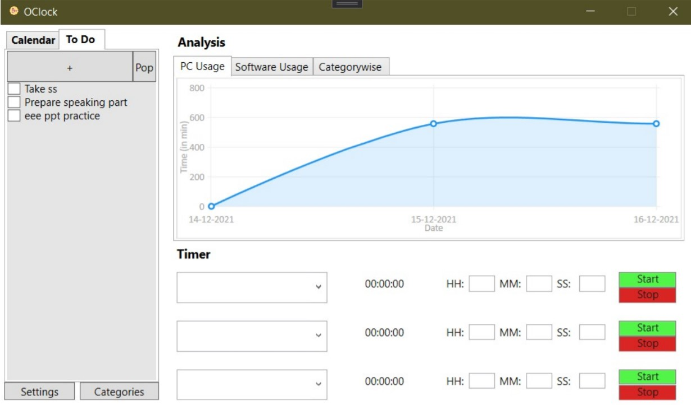

# OClock

OClock is a desktop-based software that is meant to monitor the time that a user spends on different
desktop applications hence, enabling him/her to manage his/her time and enhancing his/her
productivity.
It also provides an additional feature to the user to make note of important tasks that he/she has
planned or need to do in future.

# About

This project was done for Project Exhibition 1, towards our BTech Degree. Our Team Members are:

- Rishabh Rathi
- Ishita Agarwal
- Harshita Seth
- Saakshi Gupta
- Vridhi Puri

# Screenshots

# Dependencies

- Hardcodet.NotifyIcon. Wpf.1.1.0
- LiveCharts.0.9.7
- LiveCharts.Wpf.0.9.7
- Stub.System.Data.SQLite.Core.NetFramework.1.0.115.5
- System.Data.SQLite.Core.1.0.115.5
- WPFCustomMessageBox.1.0.7
